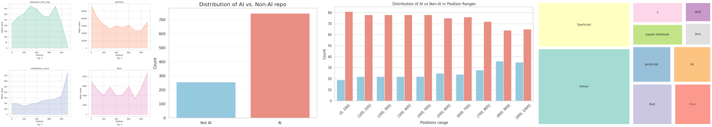

# GitHub Popularity Analysis
Analysis of the popularity of a GitHub repository. Through scraping data from [Trendshift](https://trendshift.io), we will gather the top 1000 GitHub repositories and extract a series of KPIs to create graphs that will help us understand how these repositories became trending.

This repository is part of the [Social Media Data Analysis](https://web.dmi.unict.it/corsi/l-31/insegnamenti?seuid=9C81E641-77C4-41AE-AD81-AB477BFA24AE) exam, where the task is to create a tutorial on a public API and conduct a statistical investigation on the data provided.

In this notebook, we will first provide an introduction to GitHub APIs and then proceed with the analysis of repository popularity.

## How it works
0. `git clone https://github.com/Kespers/github-popularity-analysis.git`
1. `cd github-popularity-analysis`
2. Create a GitHub token: follow the steps within the `notebook.ipynb`.
3. Create a `.env` file and add the token in the format `GITHUB_TOKEN={TOKEN}`.
4. Run `docker compose up`.
5. Access the notebook via the following link: `http://127.0.0.1:8888/tree`.